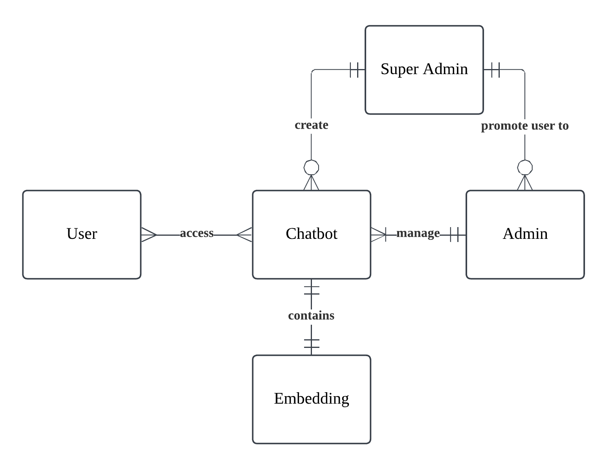
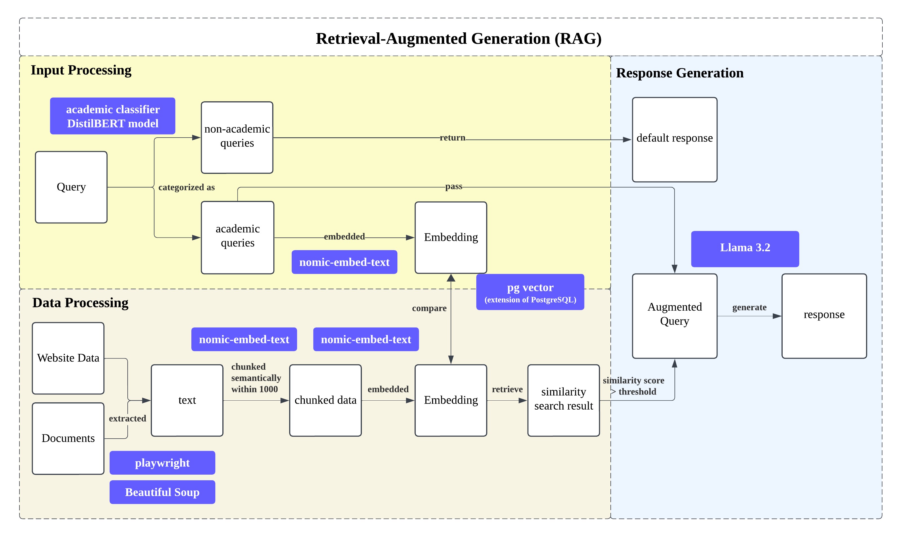
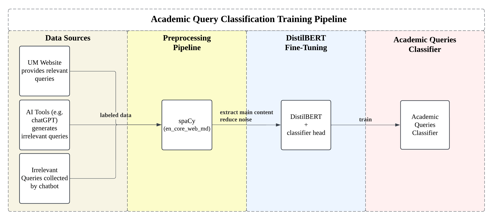

<p align="center">
  
  
</p>


<p align="center">
  A <b>Customizable Academic Chatbot</b> for Universiti Malaya <br/>
  FINAL YEAR PROJECT 2025/2026<br/>
  Developer: <b>WONG SOON JIT</b> <br/>
</p>

---

### 🦾 About The Project
<p>The Full Documentation of Project as below (still in progress)</p>
<p align="center">
  <a href="https://1drv.ms/f/c/f2b877c4aacbf3bd/IgB4IZLBLWa6RLLkZlkX2zJqAc56ESx3z5MoaisVCCvv4yc?e=S7xIab">
    
  </a>
</p>

<p align="center">
  
</p>

- AcadProBot is a customizable chatbot that integrating Large Language Models (LLM) with Retrieval-Augmented Generation (RAG) for intelligent, context-aware responses.<br/>
- It serves three stakeholders, including user, admin and super admin.<br/>
- A user can join multiple chatbots, an admin can manage multiple chatbots, while super admin manages admins and chatbots available in AcadProBot<br/>
- Each chatbot contains its own embeddings.<br/>

<p><strong>Chat and RAG Process</strong></p>
<p align="center">
  
</p>

<p><strong>ML Model DistilBERT Training</strong></p>
<p align="center">
  
</p>

---

### 🛠️ Tech Stack Implemented

<p align="center">
  
</p>

- **Frontend:** React + Vite + Tailwind CSS  
- **Backend:** FastAPI (Chat & RAG Workflow)
- **Spring Boot Service:** Spring Boot (Main)
- **Database:** PostgreSQL (Hosted via Supabase)
- **Vector Search:** pgvector + LangChain + HuggingFace Transformer
- **LLM:** LlaMA 3.2
- **Hosting / DevOps:** Docker + Docker Compose  
- **DistilBERT:** Docker + Docker Compose  

---

### 🕺🏻 Steps to run AcadProBot:

Follow these steps to run the full AcadProBot project with Docker:


#### 1️⃣ Clone the repository
```bash
git clone https://github.com/yourusername/AcadProBot.git
cd AcadProBot
```

#### 2️⃣ Download the Academic Classifier Model
Access and Download model as below:

<p align="center">
  <a href="https://1drv.ms/f/c/f2b877c4aacbf3bd/IgB4IZLBLWa6RLLkZlkX2zJqAc56ESx3z5MoaisVCCvv4yc?e=S7xIab">
    
  </a>
</p>

Move it under file backend: backend/academic_classifier_bert

#### 3️⃣ Create your local environment files
To proceed with this, kindly register an account in Supabase
```bash
# backend environment
cp backend/.env.example backend/.env
# Edit backend/.env to set DATABASE_URL, SUPABASE_URL, SECRET_KEY

# spring-service
cp spring-service/src/main/resources/application-example.properties spring-service/src/main/resources/application.properties
# Edit application.properties to configure database connection
```

#### 4️⃣ Build and start the containers
```bash
docker compose up --build
```

#### 5️⃣ Access the services

- **frontend (React):** [http://localhost:5173](http://localhost:5173)  
- **backend (FastAPI):** [http://localhost:8000/docs](http://localhost:8000/docs)  
- **spring-service (Spring Boot):** [http://localhost:8080](http://localhost:8080)

####  Notes & Tips

- **Sensitive files:** `.env` and `application.properties` contain sensitive information and **should never be pushed**.  
- **Templates:** Use `.env.example` and `application-example.properties` as templates.  
- **Database:** Backend will automatically create database tables if using SQLAlchemy / Hibernate `ddl-auto=update`.  
- **Ports:** If ports `8000`, `8080`, or `5173` are already in use, you may need to change them in the `docker-compose.yml` file or local configs.  
- **Docker resources:** Make sure Docker has enough memory for running multiple services simultaneously.  
- **Model loading:** If the model (`academic_classifier_bert`) fails to load, check that the folder exists and is copied correctly in the backend Dockerfile.

---

### 🌐 Connect with Me

<p align="center">
  <a href="https://github.com/SJWONG27"></a>
  <a href="mailto:soonjitwong@gmail.com"></a>
  <a href="https://www.linkedin.com/in/wong-soon-jit-8577b2275/"></a>
</p>


⭐️ _Thanks for visiting my Final Year Project! Feel free to reach me out._ 😄


